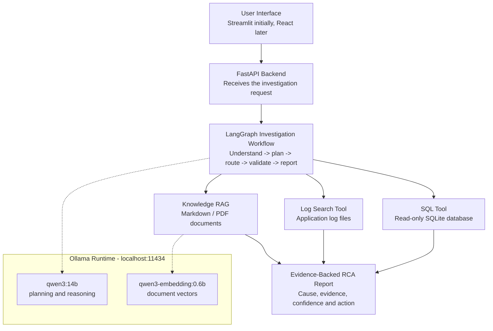
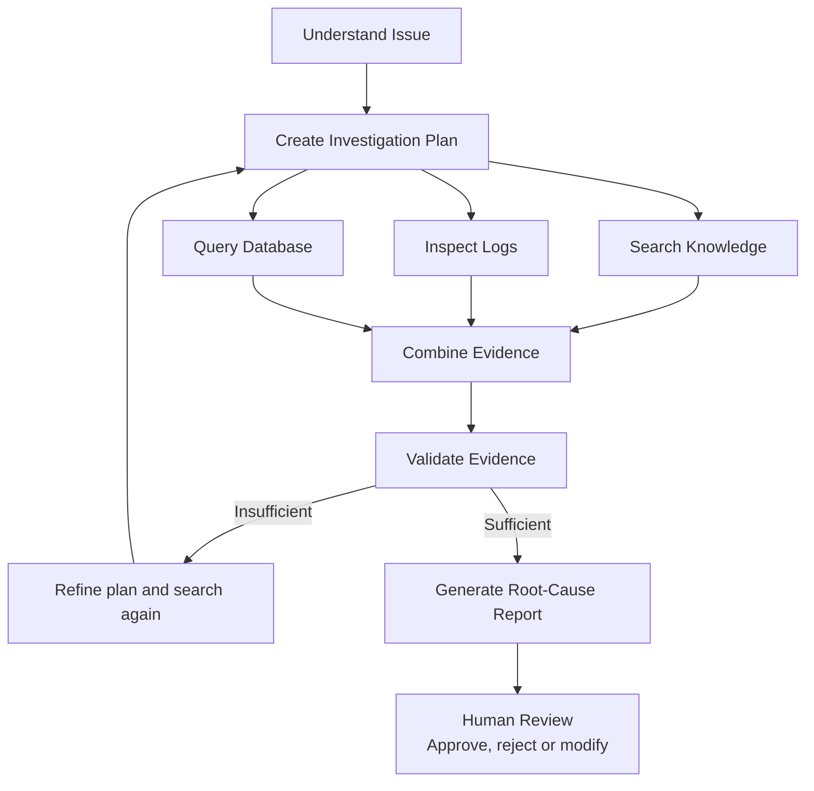

# LangChain + LangGraph with Local LLMs (Ollama)

Build an **AI Production Issue Investigator** that searches knowledge, reads logs, checks a sample
database, and produces an evidence-backed root-cause analysis — running entirely on locally hosted
models, with no API cost and no data leaving the machine.

| Pillar | Role |
| --- | --- |
| **LangChain** | Models, prompts, RAG, tools and structured output |
| **LangGraph** | State, routing, retries, memory and human approval |
| **Local LLM (Ollama)** | `qwen3:14b` reasoning, `qwen3-embedding:0.6b` retrieval, zero API cost |

---

## 1. Project Idea

**AI Production Issue Investigator.** A user enters an issue such as:

> Shipment SHP-1007 is stuck in CREATED. Find the cause.

The system then does three things:

- **Search knowledge** — retrieve workflow rules, troubleshooting documents and business conditions using RAG.
- **Inspect evidence** — search sample logs and execute safe, read-only database queries.
- **Generate RCA** — correlate all evidence and provide root cause, confidence and recommended action.

---

## 2. High-Level Architecture

The UI sends a problem to a controlled LangGraph workflow. A locally hosted `qwen3:14b` model
provides the intelligence, while LangChain connects the model to knowledge and tools. Every
inference call stays inside the Ollama runtime on `localhost:11434`.



---

## 3. Sample Business Scenario

Use fictional shipping data so the project is safe to demonstrate without exposing company
information.

**Problem**

```
Why is shipment SHP-1007 stuck in CREATED?
```

**Database evidence**

```
shipment_id: SHP-1007
status: CREATED
trailer_id: NULL
location: SEA
```

**Log evidence**

```
ERROR ShipmentWorkflowService:
No active trailer assignment found for SHP-1007.
```

**Knowledge rule.** A shipment can move from `CREATED` to `READY_FOR_DISPATCH` only when:

- A trailer is assigned.
- The assigned trailer is active.
- Location validation succeeds.

**Expected AI conclusion**

```
Root cause:
No trailer is assigned to SHP-1007.

Evidence:
- trailer_id is NULL
- Log reports no active trailer assignment
- Workflow requires a valid trailer

Confidence: 92%

Recommended action:
Assign an active trailer and retry the workflow.
```

---

## 4. LangGraph Workflow

Use explicit nodes so your leads can see a governed AI workflow rather than a single uncontrolled
prompt.



---

## 5. Technology Stack

Keep version 1 local, lightweight and easy to complete.

| Layer | Recommended Technology | Purpose |
| --- | --- | --- |
| User Interface | Streamlit | Fastest way to create a visual demo |
| Backend | FastAPI | API layer for investigation requests |
| LLM | Ollama + `qwen3:14b` (`qwen3:8b` for fast iteration) | Local planning, reasoning and report generation — no API cost or data egress |
| LLM Integration | `langchain-ollama` (`ChatOllama`, `OllamaEmbeddings`) | Connects LangChain and LangGraph to the local runtime |
| AI Components | LangChain | Prompts, models, tools, RAG and structured output |
| Workflow | LangGraph | State, routing, retries and checkpoints |
| Vector Store | Chroma | Store and retrieve embedded knowledge chunks |
| Embeddings | `qwen3-embedding:0.6b` via Ollama | Create vectors locally, no extra API cost |
| Database | SQLite | Safe sample shipping database |
| Logs | Local `.log` files | Simulate production troubleshooting |
| Deployment | Docker | Easy to run on any demo machine |

### Why local, and why the provider stays pluggable

- **Privacy.** Production logs and database rows never leave the machine — an easy win to present to
  leads who are cautious about sending operational data to a third party.
- **Cost.** No per-token billing, so you can iterate on prompts and re-run the full demo freely.
- **Swappable.** All model construction lives in one factory function, so moving to Anthropic or
  OpenAI later means changing that function only — nothing in the graph, tools or RAG layer changes.

```python
# app/llm.py — the single place a provider is chosen
from langchain_ollama import ChatOllama, OllamaEmbeddings

def get_chat_model(fast: bool = False):
    return ChatOllama(
        model="qwen3:8b" if fast else "qwen3:14b",
        base_url="http://localhost:11434",
        temperature=0,
    )

def get_embeddings():
    return OllamaEmbeddings(
        model="qwen3-embedding:0.6b",
        base_url="http://localhost:11434",
    )
```

### Model selection

| Model | Size | Use in this project |
| --- | --- | --- |
| `qwen3:14b` | 9.3 GB | Default — planning, evidence correlation and RCA generation |
| `qwen3:8b` | 5.2 GB | Fast development loop and quick prompt iteration |
| `qwen3-embedding:0.6b` | 639 MB | Chroma embeddings for the knowledge base |
| `qwen3-coder:30b` | 18 GB | Optional swap when you want maximum reasoning quality and can accept slower responses |
| `devstral:latest` | 14 GB | Optional swap if tool-calling reliability needs tuning |

### Local model setup

```bash
ollama pull qwen3:14b
ollama pull qwen3:8b
ollama pull qwen3-embedding:0.6b
ollama serve            # exposes http://localhost:11434

pip install langchain langchain-ollama langgraph langchain-chroma fastapi streamlit
```

---

## 6. Seven-Day Implementation Plan

Each day produces a working milestone, so the project remains demonstrable even before everything is
complete.

| Day | Milestone | Work |
| --- | --- | --- |
| 1 | Ollama + LangChain Foundation | Create the Python project, `pip install langchain-ollama`, point `ChatOllama` at `http://localhost:11434`, make the first `qwen3:14b` call and verify structured JSON output and tool-calling. |
| 2 | Create Tools | Build knowledge search, log search and read-only SQLite query tools. Add SQL safety validation. |
| 3 | Add RAG | Create sample workflow documents, split them, generate embeddings with `qwen3-embedding:0.6b`, store them in Chroma and retrieve relevant sources. |
| 4 | Build LangGraph | Define graph state, nodes, edges, conditional routes and evidence validation. |
| 5 | Add Memory and Human Approval | Use checkpointing for follow-up questions and pause before any recommended operational action. |
| 6 | Create the UI | Build the Streamlit screen with investigation input, live progress, evidence panels and an RCA report. |
| 7 | Demo Preparation | Dockerize the app, create three demo scenarios, prepare slides and capture fallback screenshots. |

---

## 7. Three Demo Scenarios

These scenarios clearly show the difference between RAG, tool-based investigation and controlled
agentic AI.

### Scenario 1 — Knowledge Question

```
What conditions are required for READY_FOR_DISPATCH?
```

- **Flow:** Planner → Knowledge RAG → Answer
- **Shows:** LangChain retrieval and source-grounded answers.

### Scenario 2 — Root-Cause Investigation

```
Why is shipment SHP-1007 stuck in CREATED?
```

- **Flow:** Docs → Logs → DB → Evidence validation → RCA
- **Shows:** LangGraph orchestration and multi-tool reasoning.

### Scenario 3 — Human Approval

```
Suggest how to fix shipment SHP-1007.
```

- **Flow:** Investigation → Proposed action → Human review
- **Shows:** Safe, governed agentic AI.

---

## 8. Message to Your Leads

> LangChain provides the AI building blocks. LangGraph arranges those building blocks into a
> controlled, stateful business process. A locally hosted model provides the intelligence inside the
> process — no data leaves the machine.

- **Plain local LLM call** — good for simple prompt-and-response use cases.
- **LangChain** — connects the local model with prompts, knowledge, retrieval and tools.
- **LangGraph** — controls state, routing, retries, checkpoints and human approval.

---

## 9. Keep Version 1 Simple

Do not overload the first demo. A focused and reliable workflow is more impressive than a large
unfinished system.

**Include now**

- One fictional shipping domain
- Three tools
- One vector store
- Read-only database access
- Evidence-backed response
- Human approval

**Add later**

Multiple agents, live Jira, live GitHub, production databases, autonomous writes, Kubernetes, a
complex React frontend and a large knowledge graph.

After the demo succeeds, replace the mock sources with a Git repository, real logs, Jira and a
read-only enterprise database.
