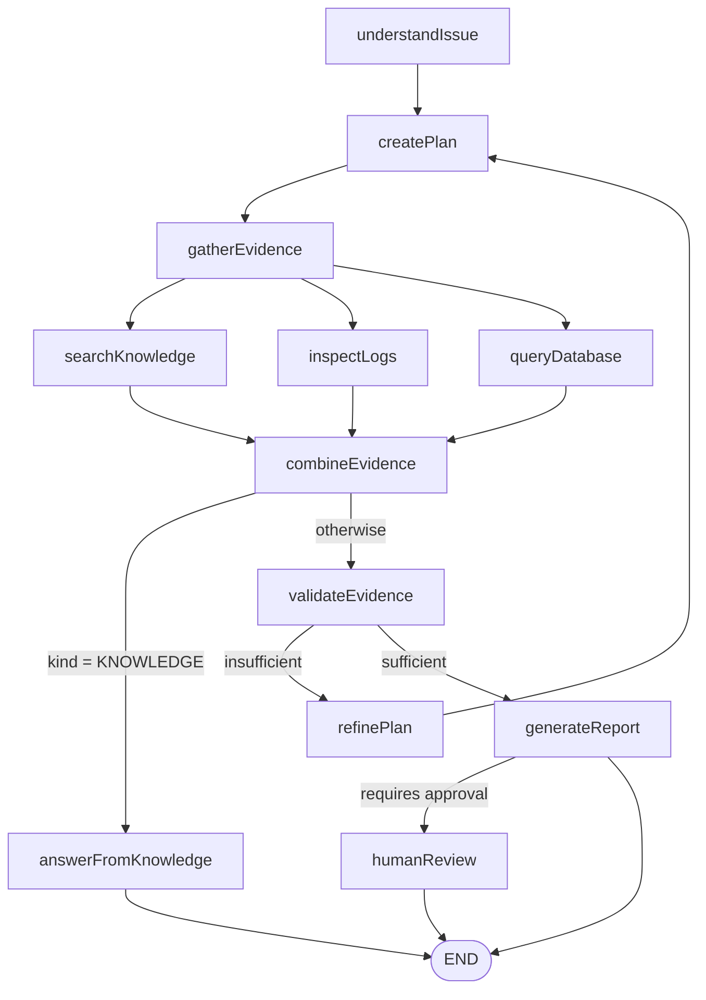

# AI Production Issue Investigator — Spring Boot + Spring AI

A Java port of the Python LangChain/LangGraph demo in the parent folder. Same fictional shipping
domain, same three evidence sources, same governed workflow with a human approval gate — built on
Spring Boot 4, Spring AI 2 and LangGraph4j, running entirely on local Ollama models.

Nothing leaves your machine.

New to Java or to this project? Read **[HOW_TO_RUN.md](HOW_TO_RUN.md)** instead, which walks
through every step.

## Quick start

```bash
ollama serve
ollama pull qwen3:14b
ollama pull qwen3:8b
ollama pull qwen3-embedding:0.6b

mvn spring-boot:run
```

Then open <http://localhost:8080>. On Windows, `start-demo.bat` does the same and opens the browser.

Before demoing, open <http://localhost:8080/health/checks>. All five checks should pass.

## What it does

Ask it why a shipment is stuck. It works out what kind of question you asked, plans which evidence
to gather, reads the documentation, the logs and the database in parallel, checks whether what it
found is actually sufficient, and only then writes a root-cause report. If the fix would change
production data, it stops and waits for a human.

## The workflow



The three evidence nodes run in the same superstep and merge their writes through appending
channels. Each one no-ops when the plan did not select it, so the graph shape stays fixed while the
plan still decides what actually happens.

## Demo scenarios

The home page offers these as one-click buttons.

| Scenario | Question | What it shows |
| --- | --- | --- |
| Stuck shipment | Why is shipment SHP-1007 stuck in CREATED status? | Full investigation across all three sources |
| Dispatch rules | What conditions must be met before READY_FOR_DISPATCH? | Documentation only, so it takes the short path |
| Request a fix | Fix shipment SHP-1007 so it can be dispatched. | Stops at the approval gate |
| Trailer in maintenance | Why can't shipment SHP-1010 be dispatched? | A different cause: the trailer is in MAINTENANCE |
| Inbound-only facility | Why is shipment SHP-1013 not moving? | A third cause: BOI does not allow outbound |

The last two matter more than they look. Three shipments are stuck for three different reasons, and
only the database row distinguishes them. If the agent were pattern-matching on the question rather
than reading evidence, it would give the SHP-1007 answer to all three.

## Performance

Measured on this machine, warm, with the model already resident in Ollama:

| Scenario | qwen3:8b (fast mode) | qwen3:14b (default) |
| --- | --- | --- |
| Stuck shipment | 2.5 s | 4.3 s |
| Dispatch rules | 2.1 s | 3.3 s |
| Request a fix | 4.7 s | 5.3 s |

Two caveats that matter when demoing:

- **The first call to a model is much slower** while Ollama loads it into memory. Run one throwaway
  question before an audience is watching.
- **Do not toggle fast mode back and forth.** Alternating between the two models makes Ollama
  evict and reload them, which took these same scenarios from ~3 s to 12–16 s. Pick one model for
  the demo and stay on it.

## Design decisions worth knowing

- **Thinking is disabled programmatically.** qwen3 otherwise emits its reasoning as plain text,
  which breaks structured-output parsing and triples latency. Set via `OllamaChatOptions` in
  `ModelGateway`, not in `application.yml`, because the `think-option` property has a binding bug.
- **Structured output is validated.** `validateSchema()` retries with the validation error fed back
  to the model, so a malformed response is corrected rather than propagated.
- **Two independent layers of SQL safety.** `SqlSafetyValidator` allows a single bare SELECT,
  strips comments so a write cannot hide behind one, and forces a LIMIT. Separately, the JDBC
  connection is opened read-only. Either alone would probably do; both is the point.
- **The single-shipment query is fixed, not generated.** Its `LEFT JOIN` is what makes an
  unassigned trailer visible as NULL. A model-written inner join returns zero rows and the root
  cause silently disappears.
- **The approval gate is not the model's decision alone.** A remediation request is treated as
  requiring approval regardless of what the model reports.
- **The fast flag lives in graph state.** In the Python build it was read from global settings and
  silently ignored, which invalidated a whole benchmark. Here it is passed per request into state.

## Layout

```
src/main/java/com/example/investigator/
  config/      AppProperties, data directory bootstrap
  llm/         ModelGateway — the only place a model provider is chosen
  domain/      records for structured output and API contracts
  rag/         KnowledgeIndexer — chunking, embedding, SimpleVectorStore
  tools/       KnowledgeTool, LogSearchTool, SqlQueryTool, SqlSafetyValidator
  graph/       InvestigationState, GraphConfig, and one class per node
  service/     InvestigationService, HealthCheckService
  web/         Thymeleaf controller and JSON API
src/main/resources/
  data/        knowledge Markdown and the application log
  db/          schema.sql and data.sql
  templates/   investigate.html, health.html
```

## API

```bash
curl -X POST http://localhost:8080/api/investigate \
  -H "Content-Type: application/json" \
  -d '{"question":"Why is shipment SHP-1007 stuck in CREATED status?","fast":true}'

curl -X POST http://localhost:8080/api/approve \
  -H "Content-Type: application/json" \
  -d '{"threadId":"<from the previous response>","decision":"approve"}'

curl http://localhost:8080/api/health/checks
```

`decision` accepts `approve`, `reject`, or any other text, which replaces the recommended action.

## Tests

```bash
mvn test
```

29 tests. `SqlSafetyValidatorTest` is a plain unit test; the rest need Ollama running.
`ScenarioRunnerTest` covers all five scenarios and `GraphFlowTest` covers routing, the approval
pause and both resume paths.

## Known limitations

- **Approvals are held in memory.** `MemorySaver` loses checkpoints on restart, so an approval must
  be completed in the same run. `FileSystemSaver` is a drop-in swap in `GraphConfig` if durability
  is wanted; the state records already implement `Serializable`.
- **`SimpleVectorStore` is a linear scan** and is officially labelled non-production. It is fine for
  a dozen chunks and is the first thing to swap. Because everything depends on the `VectorStore`
  interface, moving to Chroma or PGVector is a configuration change.
- **Confidence is self-reported** by the model and should be read as a hint, not a measurement.

## Differences from the Python version

| | Python | Java |
| --- | --- | --- |
| Graph | LangGraph | LangGraph4j 1.8.26 |
| Vector store | Chroma | SimpleVectorStore (in-memory, file-persisted) |
| Checkpoints | SQLite, durable | MemorySaver, in-process |
| UI | Streamlit | Thymeleaf server-rendered |
| Fan-out | list of node names from one edge | fixed parallel branches that no-op when unselected |

Behaviour visible to a user is the same in both.
